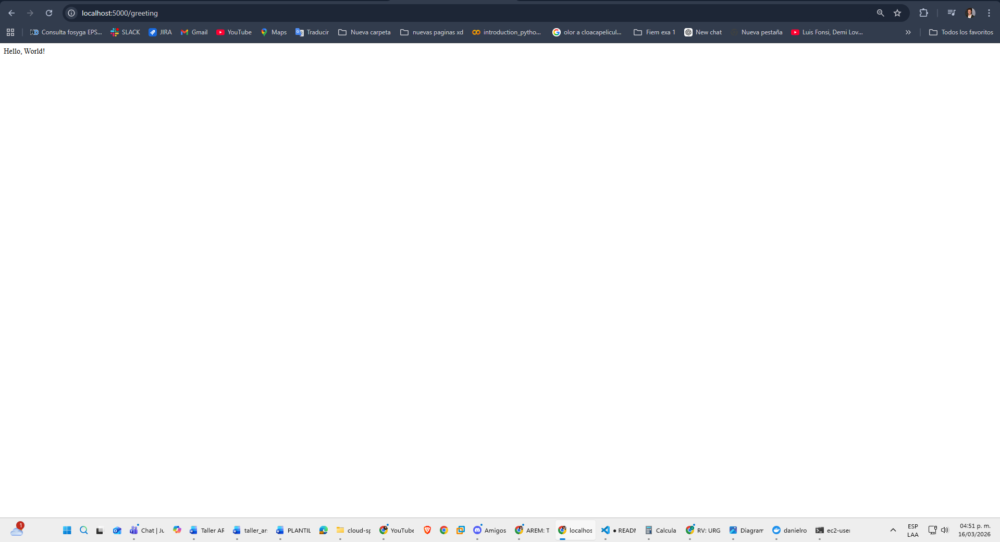
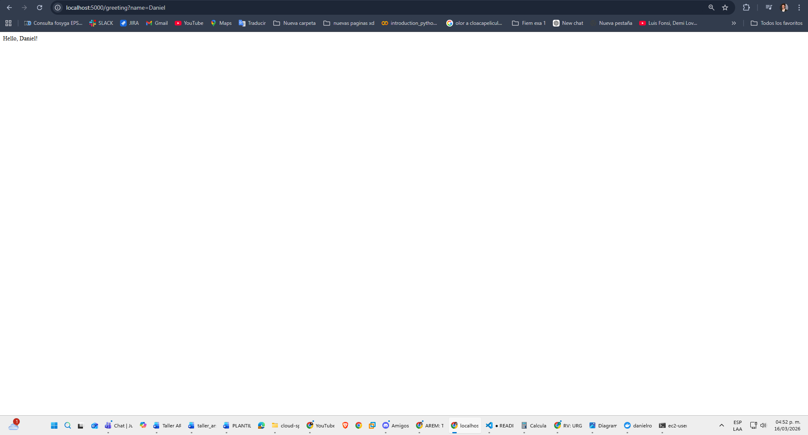
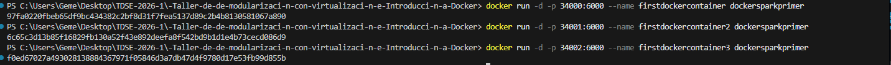
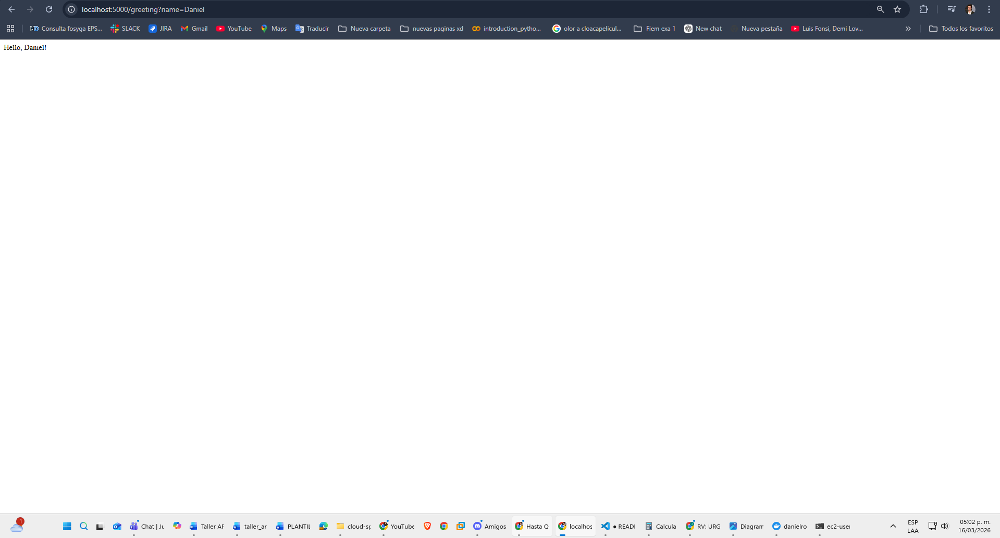
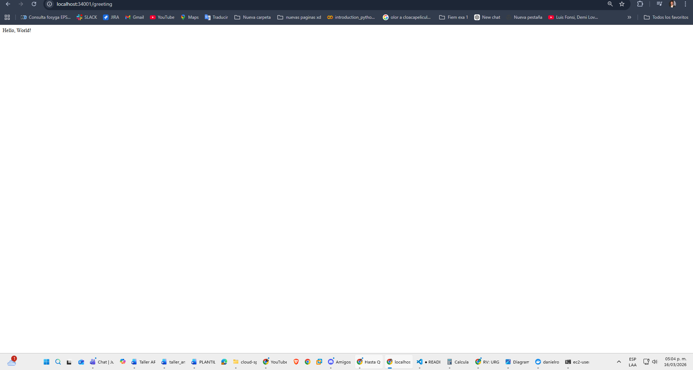
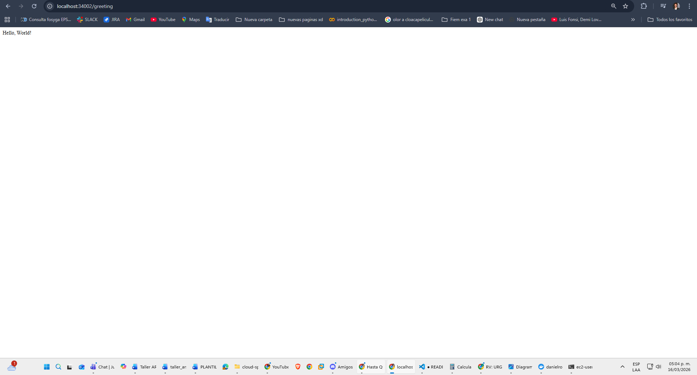
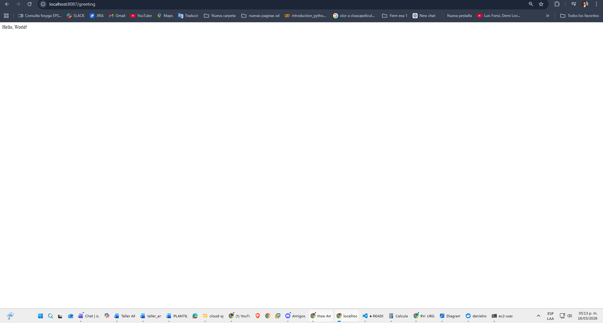
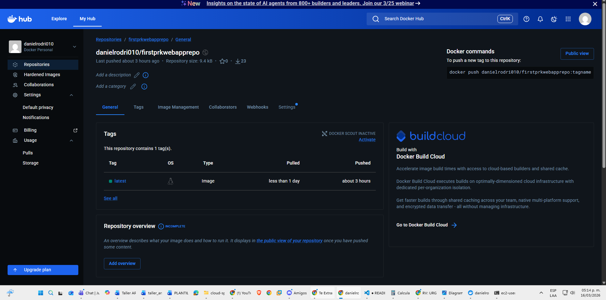
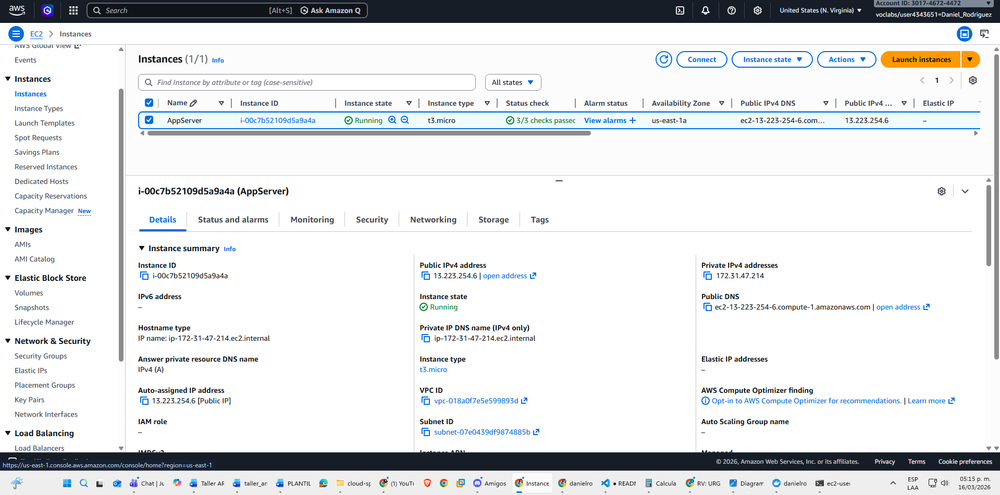
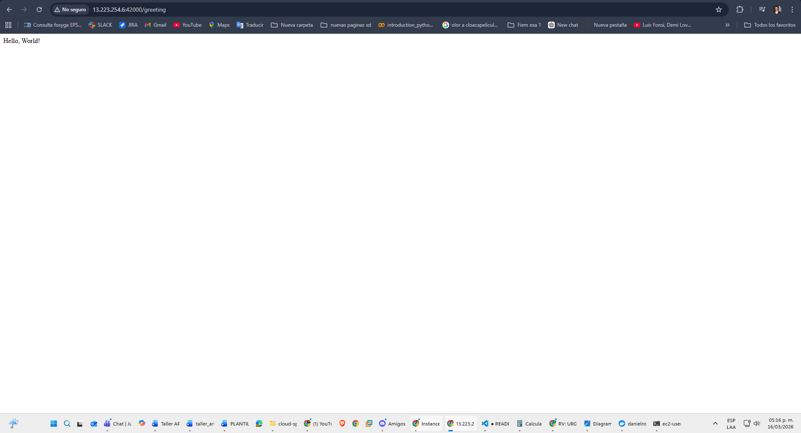

# Modularization Workshop with Virtualization and Introduction to Docker

## General Description

This project is a REST web application built with **Spring Boot** that exposes a greeting endpoint. The main goal of this workshop is to learn how to containerize a Java application using **Docker**, manage its distribution through **Docker Hub**, and deploy it to the cloud using **AWS EC2**.

The application itself is intentionally simple: the focus is not on business logic but on the process of packaging, distributing, and deploying the application across different environments in a reproducible and isolated way.

---

## Architecture

The system architecture is based on Docker containers that allow the application to run in an isolated environment, independent of the host operating system. This ensures identical behavior across any environment, whether local or in the cloud.
```
[Client/Browser]
        |
        | HTTP Request
        v
[AWS EC2 - Port 42000]
        |
        | Docker Port Mapping 42000:6000
        v
[Docker Container]
        |
        | Internal Port 6000
        v
[Spring Boot - HelloRestController]
        |
        v
    "Hello, World!"
```

The image distribution flow is as follows:
```
Source Code → Maven Build → Docker Image → Docker Hub → AWS EC2
```

First, the project is compiled with Maven. Then a Docker image is built that packages the application along with all its dependencies. This image is published to Docker Hub as a central repository, from where any server (in this case AWS EC2) can pull and run it as a container.

---

## Class Design

The project has two main classes that communicate through the Spring Boot framework:

**`RestServiceApplication`** is the entry point of the application. It is responsible for starting the Spring Boot server and dynamically configuring the listening port by reading the `PORT` environment variable. If this variable is not defined, it defaults to port 5000. This is important for Docker deployment, where the port is controlled from the container through environment variables.

**`HelloRestController`** is the REST controller that handles HTTP requests. It exposes the `GET /greeting` endpoint, which accepts an optional `name` parameter. When a client makes a request to that endpoint, the controller generates and returns a personalized greeting message. If no parameter is provided, it responds with `Hello, World!`.

The communication between the two classes is managed internally by Spring Boot: on startup, `RestServiceApplication` automatically registers the controller and sets it to listen on the configured port.

---

## How to Compile and Generate the Image

### Prerequisites
- Java 17
- Maven 3.x
- Docker Desktop

### 1. Compile the project
```bash
mvn clean package
mvn dependency:copy-dependencies
```

This generates the `.class` files in `target/classes` and copies all dependencies into `target/dependency`, which are the files Docker needs to build the image.

### 2. Dockerfile

The `Dockerfile` defines how the image is built. It uses `eclipse-temurin:17` as the base image (the official Java 17 distribution), copies the `.class` files and dependencies into the container, and defines the application startup command.
```dockerfile
FROM eclipse-temurin:17
WORKDIR /usrapp/bin
ENV PORT 6000
COPY /target/classes /usrapp/bin/classes
COPY /target/dependency /usrapp/bin/dependency
CMD ["java","-cp","./classes:./dependency/*","co.edu.escuelaing.sparkdockerdemolive.RestServiceApplication"]
```

### 3. Build and publish the image
```bash
# Build the image
docker build --tag dockersparkprimer .

# Tag for Docker Hub
docker tag dockersparkprimer danielrodri010/firstprkwebapprepo

# Publish to Docker Hub
docker login
docker push danielrodri010/firstprkwebapprepo
```

### 4. Deploy on AWS EC2
```bash
# Inside the EC2 instance
docker run -d -p 42000:6000 --name firstdockerimageaws danielrodri010/firstprkwebapprepo
```

---

## Tests and Results

### Service running locally



### Service with name parameter



### Docker image built and three containers running


### Containers accessible on different ports










### Docker Compose with app and MongoDB


### Service with Docker Compose on port 8087



### Image published on Docker Hub



### EC2 instance running on AWS



### Service deployed on AWS



---

## Author
Daniel Rodriguez  
Escuela Colombiana de Ingeniería Julio Garavito  
2026